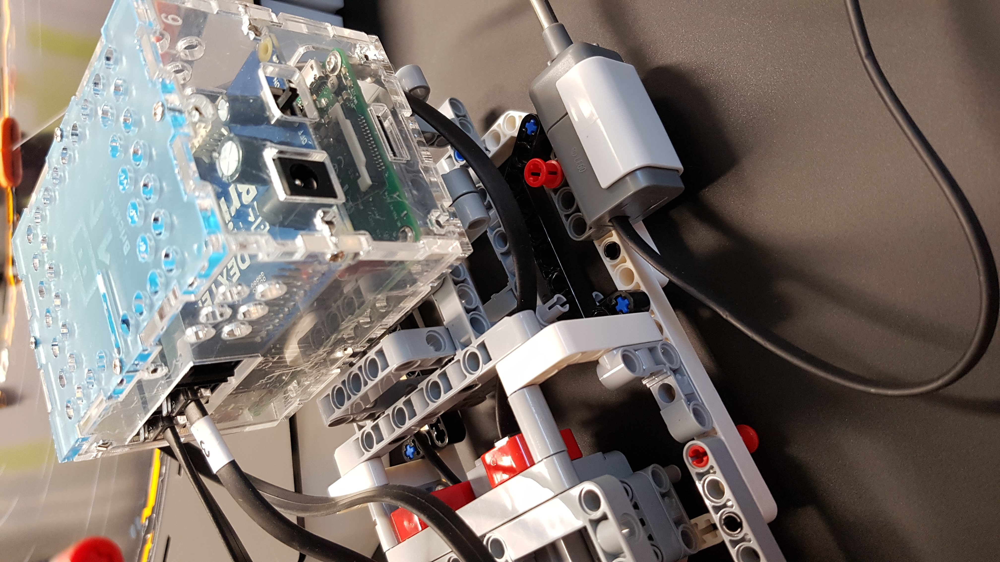
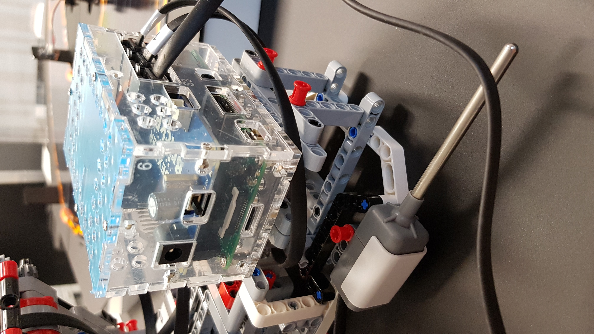
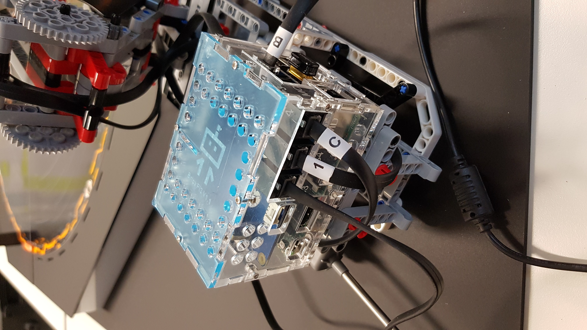
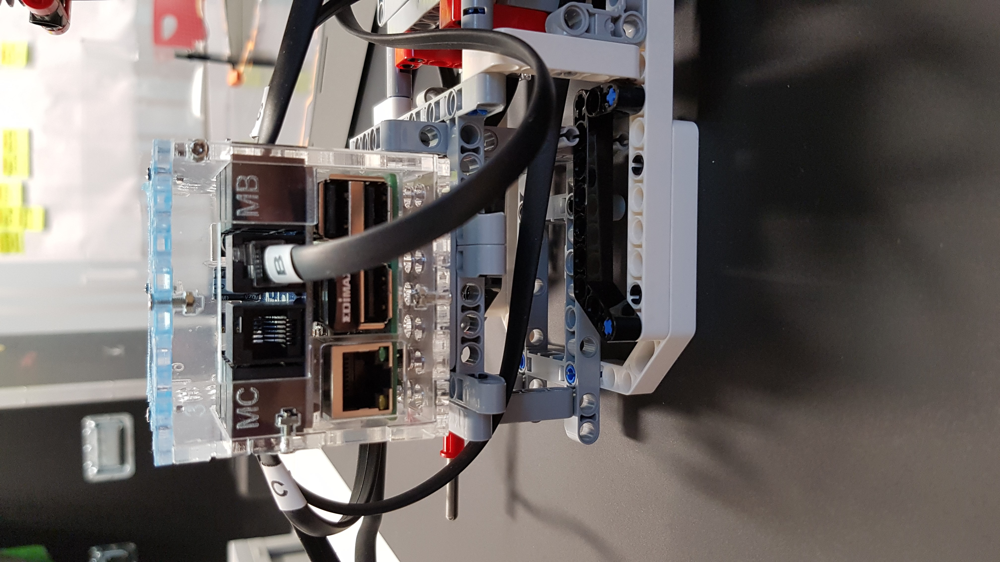

# legoRoboArm
python 3.4 code for lego mondstorm ev3 H25 roboArm.
python 3.5.2 for Brickpi 3 and Raspberry pi 3B

Two codes available:

- legoroboarmweb.py ---> python code with web.py webserver to send commands to roboarm
- legoroboarmtornado.py --> python code with tornado webserver to send commands to roboarm. 
- legoroboarmtornadoBrickPi3.py --> python code with tornado webserver and BrickPi3 (raspberry pi3B instead of ev3 controller).

Web.py is a blocking webserver and API coded in python. http://webpy.org
Tornado is a non-blocking webserver and API coded in python. http://www.tornadoweb.org/en/stable/#

To run this project you'll need:

- A lego mindstorm EV3 H25 roboarm (build instructions on http://robotsquare.com/wp-content/uploads/2013/10/45544_robotarmh25.pdf)
- Wifi dondle for EV3 controller (wifi enable)
- Temperature sensor to simulate a roboarm failure
- web.py libraries for web.py version
- tornado libraries for tornado version

- Lego Ev3 Controller from mindstorm brand (full LEGO project version)
- Raspberry pi 3B + BrickPi3 - Dexter Industries started kit https://www.dexterindustries.com/shop/brickpi-starter-kit/ that includes:
    * BrickPi3 board
    * BrickPi 6-sided Acrylic Case
    * Battery Power Pack (8AA batteries not included)
    * microSD Card, but you’ll need Raspbian for Robots, which you have to download and install yourself
    * Raspberry Pi 3B
    * Power Supply Wall Adapter (110-240V) is recommended so you don’t drain the batteries while you are programming.
    * Ethernet Cable
    * Light & Color Sensor
    
    * Additional universal power supply to avoid use batteries - https://www.amazon.es/dp/B002E4WNWI/ref=asc_df_B002E4WNWI54594988/?tag=googshopes-21&creative=24538&creativeASIN=B002E4WNWI&linkCode=df0&hvdev=c&hvnetw=g&hvqmt=

For Raspberry pi3 + BrickPi version you need additional lego bricks. (be acreative and adapt it at your needs).

To install web and tornado libraries you must installed pip in you python environment. You can use pip or pip3
to install pip or pip3:

in Ubuntu       : sudo apt install python3-pip
in Debian Jessie: sudo apt-get install python-pip

To install web.py and tornado:

- sudo pip install web.py
- sudo pip install tornado

other libraries:

- sudo pip install requests

Additional resources: 
---------------------
This python files was coding with pyCharm Jetbrains IDE. You can get it for free at: www.jetbrains.com/PyCharm

More information about lego EV3 development at http://www.ev3dev.org/

In that website you can get a new firmware to change lego ev3 firmware with ev3dev firmware (more functionalities and languajes, including python 3.4 version for lego ev3 and python 3.5.2 for raspberry pi3 - debian stretch).

Raspberry pi3 lastest debian stretch images - https://oss.jfrog.org/list/oss-snapshot-local/org/ev3dev/brickstrap/

In ev3dev.org you can get instructions to configure a dev environmet (git) with python, ev3dev firmware and pycharm

To execute the python scripts you must copy them in the ev3 controller or Raspberry pi3.
You can remote access to the linux jessie/stretch of ev3 controller/raspberry pi with putty.

- User: robot
- pass: maker

To execute the script:
- chmod +x <script_name>.py
- python3 <script_name>.py

If you exit the script with CTRL+Z, webserver and two process could get defunc state. To avoid memory leaks or problem with defunc process you culd execute:

- ps -al 

and search the defunc process, take note of PPID field

- kill -9 PPID

All defunc process with the same PPID will be killed

WEB SERVER Commands:
--------------------

Lego ev3 controller shows you the ip address. You can get postman at https://www.getpostman.com/ to send commands to the robo arm. Default port is **8080**

- GET type: ip_address:8080/initialize/ ---> First command to initialize the robo arm

- GET type: ip_address:8080/move_start/ ---> infinite movement command. You can stop movement pressing backspace button (ev3 controller) or reaching the max temperature in the temperature sensor. Robo arm detects a fail and stop movement.
- GET type: ip_address:8080/move_stop/  ---> stop the robo arms and reset the sensors and motors. You must to send an initialize command after a stop command. If you send move_start command (infinite movement) other move_start or initialize commands will not work until infinite movement ends (failure detected). if you send move_stop the arm will stop infinite movement too.
- GET type: ip_address:8080/get_temperature/ ---> get the temperature from temperature sensor.

LOG FILE:
--------------------

for additional information about the program running, you can review the roboarm.log file. You can change log detail inside the legoroboarmxxx.py script. Default detail is INFO (no debug information), but you can change to DEBUG to get more detailed information.

To change log detail level, you can change it in the script:

# init logger... change logging.DEBUG to increase or decrease log details.
logger = logging.getLogger(__name__)
logging.basicConfig(filename='roboarm.log',
                    level=logging.DEBUG,
                    filemode='w',
                    format='%(asctime)s %(levelname)8s: %(message)s')

